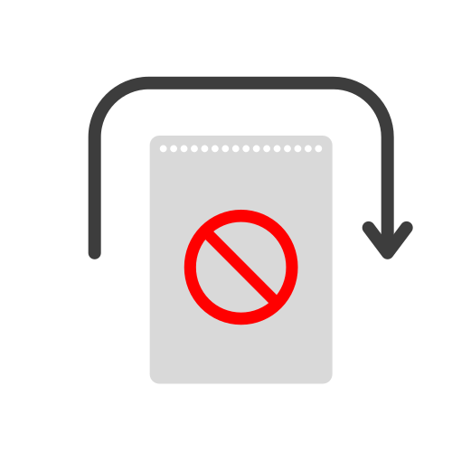

# Skip-Middle-Pages

A Tampermonkey script that help you to skip the middle page to visit the link directly.

一个帮助跳过中间页面直接访问目标链接的油猴脚本。

Click [here](https://greasyfork.org/zh-CN/scripts/472496-skip-middle-pages) to install.

## Contribute

### Add a new site

Edit `src/config.ts` to add a new site.
The key of the record is the link of the site, and the value is skip method.

There are two skip methods now:

- take target link from query string, just fill in the key of query string.
- click the specified element, just fill in the selector of the element.

The other attributes are optional and you can read the `src/types.ts` to learn more.

### Add a new skip method

TODO